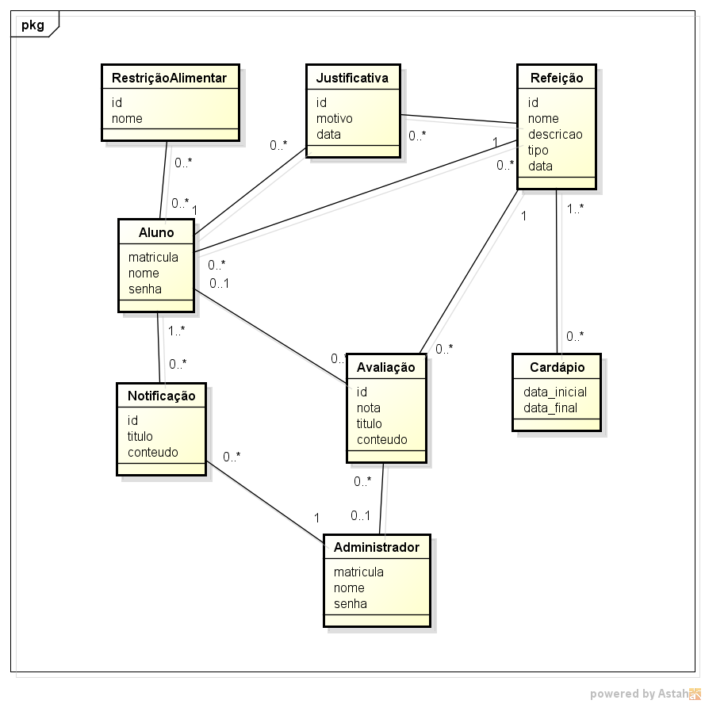

# Modelo Conceitual

## Diagrama de Classes de Análise do projeto:

## Principais Entidades:

- **Aluno** : Representa os alunos da instituição.
- **Administrador** : Representa os gerenciadores dos cardápios do refeitório e da cantina.
- **Cardápio** : Lista de Refeições do dia/semana.
- **Refeição** : Prato de comida.
- **Avaliação** : Avaliação realizada por um aluno ou administrador sobre uma Refeição.
- **Justificativa** : Justificativa de falta de uma refeição importante, por exemplo: almoço, realizada por um aluno.
- **Notificação** : Mensagem enviada por um administrador para um/uns alunos, por exemplo: mudança repentina do cardápio.
- **Restrição Alimentar** : Exclusão de determinados alimentos de um aluno, por exemplo: intolerância à lactose.

## Atributos das Entidades:

- **Aluno** : matrícula do IFRN, nome de usuário e senha.
- **Administrador** : matrícula do IFRN, nome de usuário e senha.
- **Cardápio** : data do início do cardápio e de fim.
- **Refeição** : id, nome, descrição da refeição, tipo (lanche, almoço, jantar) e data da refeição.
- **Avaliação** : id, nota (avaliação do usuário sobre um prato), título e conteúdo (explicação da avaliação).
- **Justificativa** : id, motivo (explicação da falta) e data da falta.
- **Notificação** : id, título e conteúdo (assunto da notificação).
- **Restrição Alimentar** : id, nome da restrição.

## Relacionamentos entre as Entidades:

- Um aluno pode ter várias restrições e uma restrição pode estar em vários alunos.
- Um aluno pode realizar várias justificativas e uma justificativa deve ser realizada por um aluno.
- Uma justificativa está relacionada a refeição de um dia específico e uma refeição pode estar associada a várias justificativas de falta.
- Um aluno pode estar associado a várias refeições e uma refeição pode estar associada a vários alunos.
- Um aluno/administador pode realizar várias avaliações e um avaliação precisa ter um usuário.
- Uma avaliação precisa estar associada a uma refeição específica e uma refeição pode ter várias avaliações.
- Uma refeição pode estar contida em vários cardápios e um Cardápio precisa ter várias refeições.
- Um administrador cria e envia uma notificação a vários alunos e um aluno pode receber várias notificações que são criadas por um administrador específico.
